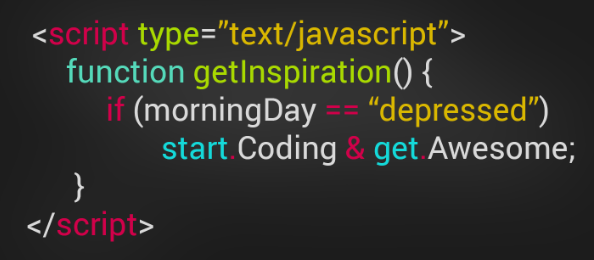
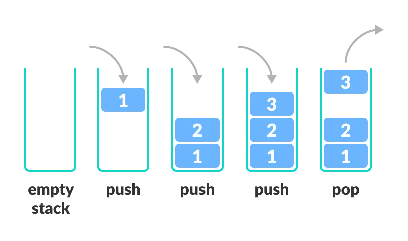
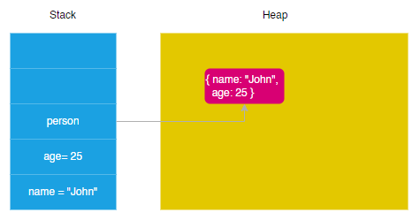
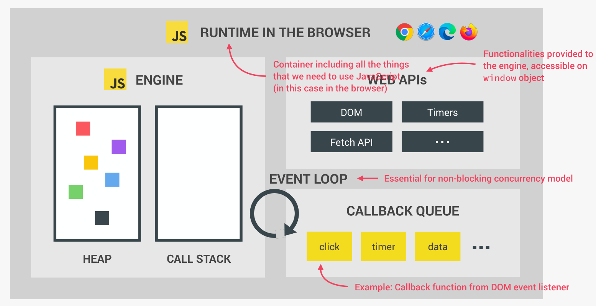
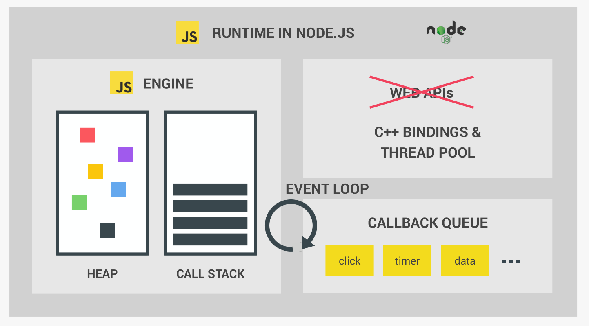

## JS Engine
JavaScript Programming Language executed in JS Engine. Which take high level human readable code and make it / Translate it into machine readable code. Popular JS Engines are,

1. Chrome V8 Engine (Powering Chromium, Chrome, MS Edge)
2. Node JS
3. SpiderMonkey (Powering Firefox)

We write human friendly code in Code Editor like VS code

Then JS Engine translate it into machine code. 

The computer machine can not understand without 0s & 1s. Why computer can not understand without 0s & 1s? There have come jointly electronic and computer science engineering theory what mostly cover in CSE course. 

## Stack & Heap 
**Stack in Data Structure:** Stack is a list of elements in which an element may be inserted or deleted only at one end, this means the elements are removed from a stack in reverse order of the way in which they are inserted. Two basic operation of Stack is push & pop. 

**Heap in Data Structure:** Heap is a special Tree-based data structure.

## In JS Stack and heap memory
When declare variables, the JavaScript engine allocates the memory for them on two memory locations: 
**stack** and **heap**.

### Static Data type store in stack
Static data is the data whose size is fixed at compile time. Static data includes,

* Primitive values (null, undefined, boolean, number, string, symbol, and BigInt)
* Reference values that refer to objects.

Because static data has a size that does not change, the JavaScript engine allocates a fixed amount of memory space to the static data and store it on the stack. 

For integer data type memory can store +9007199254740991 or -9007199254740991 amount vales in 64bit computer system.

### Objects and functions are store in Heap
JavaScript stores objects (and functions) on the heap. The JavaScript engine doesn’t allocate a fixed amount of memory for these objects. Instead, it’ll allocate more space as needed.

Internally, the JavaScript engine allocates the memory as shown in the following picture,

## JS Engine Execution

Here is a picture of JS Engine execution,

## JS Runtime

### JavaScript Runtime in Browsers
When JS working or executing in browser, JS can interacting with Web API features like DOM, Timers, Fetch API. Features like DOM is not part of JavaScript, it a part of Browser, JS can interact or work with these. Here is a overview picture of JavaScript Runtime in Browsers

### JavaScript Runtime in Node
When JS working or executing in Node, JS can not interacting with Web API features like DOM, Timers, Fetch API. In Node runtime there have C++ Bindings & Thread Pool. Here is a overview picture of JavaScript Runtime in Node

---
Credit: 
1. Jonas JavScript Lecture
2. Javascripttutorial.net - [Javascripttutorial.net](https://www.javascripttutorial.net/javascript-primitive-vs-reference-values/)
3. javascript.info - [javascript.info](https://javascript.info/types)

