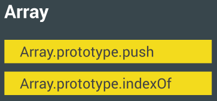

## What is JavaScript?

Javascript Is A High-Level, Prototype-Based Object-Oriented, Multi-Paradigm, Interpreted Or Just-In-Time Compiled, Dynamic, Single-Threaded, Garbage-Collected Programming Language With First-Class Functions And A Non-Blocking Event Loop Concurrency Model.

### High Level
Any low level computer Programs needs memory resources to execute programs like in C programming language.

But High level programming language like JavaScript or Python we do not need to allocate memory resources to execute programs, it is happen automatically in high level programming language. We can say, It's a feature of high level programming language.

### Prototype based object oriented
JavaScript is a prototype based object oriented programming language, means code can inherit from prototype.

Here an Array Push in Prototype,


in code we write as

```js
    const arr = [1, 1, 3];
    arr.push(4);
```
### Multi paradigm
What is Paradigm actually? 

The Paradigm is an approach and mindset of structuring code, coding style and technique. Like,

1. Procedural programming
2. Object-oriented programming (OOP)
3. Functional programming (FP)

JavaScript is a multi paradigm programming language, means we can do code in any paradigm style.

### Interpreted or just-in-time compiled
JavaScript Programming Language Interpreted or just-in-time compiled programming language. We do code in JavaScript Language then JS Engine compile it into machine code inside them. That's why it is called just-in-time compiled language. 

Compilation: Entire code is converted into machine code at once, and written to a binary file that can be executed by a computer.

Interpretation: Interpreter runs through the source code and executes it line by line.

Just-in-time (JIT) compilation: Entire code is converted into machine code at once, then executed immediately.

### Dynamic 
JavaScript is a dynamic typed programming language. That means our JS language can understand data type by it's values. Like,

```js 
    let x = 20; // it is integer data type, we do not need to mention it to the language.
    let y = true; // it is Boolean data type, we do not need to mention it to the language.
```
And if we also change data type the programming language can understand it. Like,

```js 
    let x = 20; // it is integer data type, we do not need to mention it to the language.
    let x = "Humans"; // We change integer data type to String data type, we do not need to mention it to the language.
```
### Single Threaded and Non-blocking event loop
JavaScript is single Threaded but handles multiple tasks happening at the same time. But at the same time JS have non-blocking behavior. How?

By using an event loop: takes long running tasks, executes them in the “background”, and puts them back in the main thread once they are finished.

### Garbage collected
In low level computer Programs it needs to Clean the memory but high level programming language we do not have to do it. 

### First-class functions
In a language with first-class functions, functions are simply treated as variables. We can pass them into other functions, and return them from functions.

Here we pass a function into variable,

```js 
    const firstClass = (add) => {
        return 10 - add
    }

    let output = 20 - firstClass(5);
    console.log(output);

    //output: 15
```

---
Credit: Some content credited from Jonas. 


