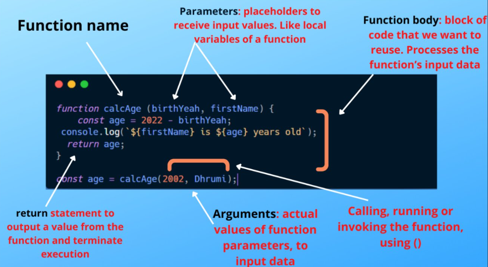

## Function Structure 

### functions Topics

🔶What is function?
🔷 

🔶What is function keyword?
🔷 

🔶What is Parameter?
🔷 

🔶What is Arguments?
🔷 

🔶 What is Callback Function?

🔷 When a Function **takes a function as a parameter** and **that function called inside the function**, then it is called callback function.

🔶What us Function Expression?
🔷 

* Pure function
* first Class function
* closures
* callback

🔶
🔷 