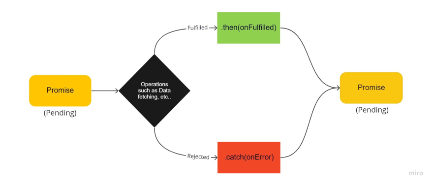

## Promise

* promise structure

* promise states

    * pending: The initial state of a Promise.
    * Fulfilled: The Promise has been resolved and the resulting value is available.
    * Rejected: The Promise has been rejected and an error occurred.

> Once a Promise is settled, it cannot be resettled. The resolve() or reject() function can only be called once, and any subsequent calls to these functions will have no effect. The immutability of a settled Promise is an important feature because it ensures that the Promise's value remains consistent and predictable. Once a Promise is settled, its value cannot be changed, which helps prevent unexpected behavior and makes it easier to reason about the code.