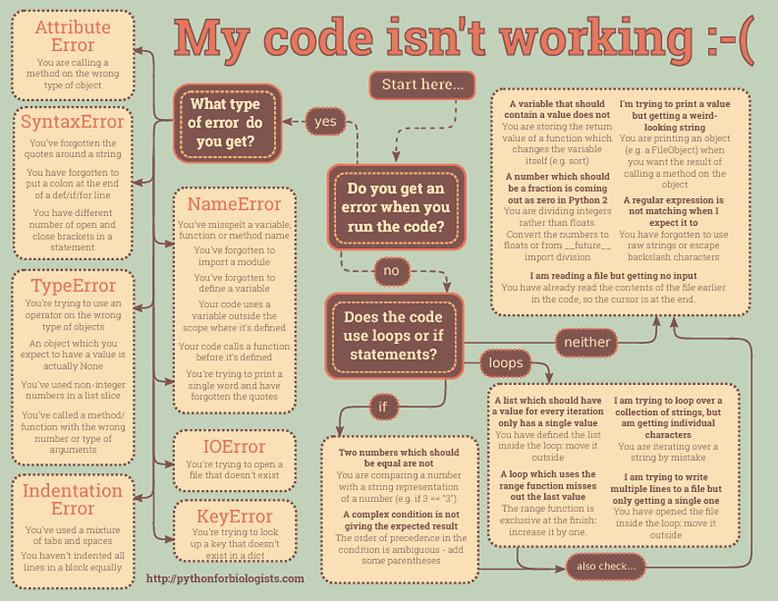

# JavaScript Error Handling

## Basic Error handling

* Attribute Error
* Syntax Error 
* Type Error 
* Indentation Error 

JavaScript Error Handling at a glance



## Handling with Programming 

1. JavaScript use ```try...catch``` to handle the errors. In this construct we use ```try``` to execute in our target code block to check if there is any error. If there is any error then we send the error in the ```catch``` block. 

